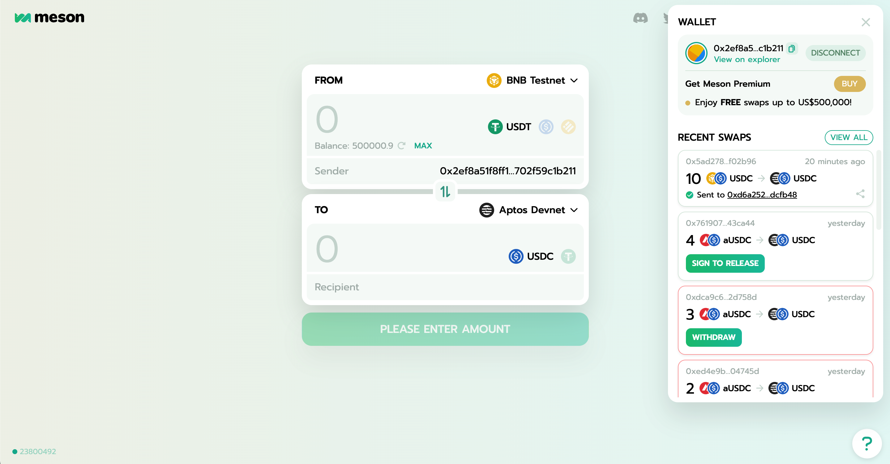

# Meson Contract on Move

## Introducing Meson

Meson (https://meson.fi) is the faster and safer way to execute low-cost, zero-slippage stablecoin **cross-chain swaps** across all leading blockchains and layer-2 rollups. As Aptos' mainnet launched on October, Meson is also preparing for launching on Aptos and other Move-based layer-1 blockchain, such as Sui and Starcoin.

As shown in the figure below, Meson is now ready on Aptos Devnet!



See [Introducing Meson : the boundless highway for cross-chain stablecoins swap
](https://medium.com/@mesonfi/introducing-meson-the-boundless-freeway-for-cross-chain-stablecoins-movements-a30d07255519) to learn more about Meson. If you want to dive into the technical details, you can also read our documentation on [Meson Docs](https://docs.meson.fi/).

<br/>


## How To Use

### Directly using Meson on browser

If you wants to try using Meson on Aptos Devnet, enter [Meson Testnet App](https://meson-testnet.herokuapp.com/) to make a transaction and find it on the [Meson Testnet Explorer](https://testnet-explorer.meson.fi/).

If you wants to use Meson on other EVM chains to swap your real stablecoin assets, enter [Meson App](https://meson.fi/) to make a transaction and find it on the [Meson Explorer](https://explorer.meson.fi/). Meson now supports 11 blockchains on mainnet.

<br/>

### Running Meson protocol in this project

Follow the steps to deploy a new Meson protocol on Aptos Devnet:

```
yarn install
yarn deploy
```

After that, the Meson protocol should already be published on a new address and well initialized. For convenience, we use two deployed fake coins to simulate USDC and USDT: `0x1015ace920c716794445979be68d402d28b2805b7beaae935d7fe369fa7cfa0::aUSDC::TypeUSDC` and `0xaaefd8848cb707617bf82894e2d7af6214b3f3a8e3fc32e91bc026f05f5b10bb::aUSDT::TypeUSDT`. 

The address and the private key (just for test) of the liquidity provider is given in environment variables file `.env`, and it has enough fake USDC and fake USDT to deposit into the liquidity pool in contracts.

Then, you can see a cross-chain swap demo by running:

```
yarn swap
```

And you will see the swap process.


<br/>

### Introducing meson code structure

Meson contracts on move contains the module below: 

- `MesonCoins.move`: The contract about the supported stablecoins. We use the coin standard `aptos_framework::coin` on Aptos to support stablecoins.

- `MesonConfig.move`: The constant variables used in the contracts.

- `MesonHelpers.move`: Contains some utils functions used in other contracts.

- `MesonStates`: Contains some utils functions about LP (Liquidity Provider) related functions.

- `MesonSourceChain.move`: The contract for cross-chain swaps when Aptos is the source chain. The main entry function is `postSwap` and `executeSwap`, which is the implementation of **Step 2 (Post and bond a swap)** and **Step 6 (Receive initial funds)** in [Meson Swap Process](https://docs.meson.fi/protocol/meson/process).

- `MesonTargetChain.move`: The contract for cross-chain swaps when Aptos is the target chain. The main entry function is `lock` and `release`, which is the implementation of **Step 3 (Lock the swap)** and **Step 5 (Release fund)** in [Meson Swap Process](https://docs.meson.fi/protocol/meson/process).

<br/>


<!-- ## Deploy on Aptos

### Install Move CLI and Aptos CLI

1. Follow the guidance in [Move Tutorial](https://github.com/move-language/move/tree/main/language/documentation/tutorial#step-0-installation) by Move official documention to install the move CLI(Command Line Interface). Run ```move -V``` to check the version.

2. Follow the guidance of [Installing Aptos CLI](https://aptos.dev/cli-tools/aptos-cli-tool/install-aptos-cli) by Aptos official documention to install the Atpos CLI(Command Line Interface). Run ```aptos -V``` to check the version.

<br/>

### Compile the move package

A Move package source directory contains a ```Move.toml``` package manifest file along with a set of subdirectories:

```
a_move_package
├── Move.toml      (required)
├── sources        (required)
├── examples       (optional, test & dev mode)
├── scripts        (optional)
├── doc_templates  (optional)
└── tests          (optional, test mode)
```

You can run command ```move build``` or ```aptos move compile```(recommended) under the move package dir to compile a move package (such as the root dir of this project). Run ```move --help``` or ```aptos move --help``` for more.

<br/>

### Deploy the contract on Atpos using Aptos CLI

Run ```aptos init``` to prepare for deploying. The account information will be saved in ```.aptos/config.yaml```. See [Initialize local configuration and create an account](https://aptos.dev/cli-tools/aptos-cli-tool/use-aptos-cli/#initialize-local-configuration-and-create-an-account) for more.

Then run the command to deploy the contract:

```bash
aptos move publish --package-dir <package-dir> --named-addresses <address-name>=<address> --private-key <private-key>
``` 

The given ```<address-name>``` should be mentioned in ```Move.toml``` like this:

```toml
[addresses]
std = "0x1"
aptos_token = "0x3"
Meson = "_"
``` 

However, if you've already initialized the account and the account address is, for example, ```0x5566```, then you can replace the address in ```Move.toml``` by ```Meson = "0x5566"``` and directly run the command below:

```bash
aptos move publish --package-dir <package-dir>
```

See [Publish the HelloBlockchain module with the Aptos CLI](https://aptos.dev/tutorials/your-first-dapp/#publish-the-helloblockchain-module-with-the-aptos-cli) for more.

<br/>

### Deploy the contract on Aptos using Aptos SDK in javascript/typescript

Follow the guidance and run [yourcoin.ts](https://github.com/aptos-labs/aptos-core/blob/main/ecosystem/typescript/sdk/examples/typescript/your_coin.ts) to learn the deployment method in SDK. Simply put, compile the move package and run the command below:

```typescript
const packageMetadata = fs.readFileSync(path.join(modulePath, "build", "Examples", "package-metadata.bcs"));
const moduleData = fs.readFileSync(path.join(modulePath, "build", "Examples", "bytecode_modules", `${moduleName}.mv`)); 
``` -->

<!-- See [yourcoin.ts (Line 97~100)](https://github.com/aptos-labs/aptos-core/blob/main/ecosystem/typescript/sdk/examples/typescript/your_coin.ts#L97) for more. -->
